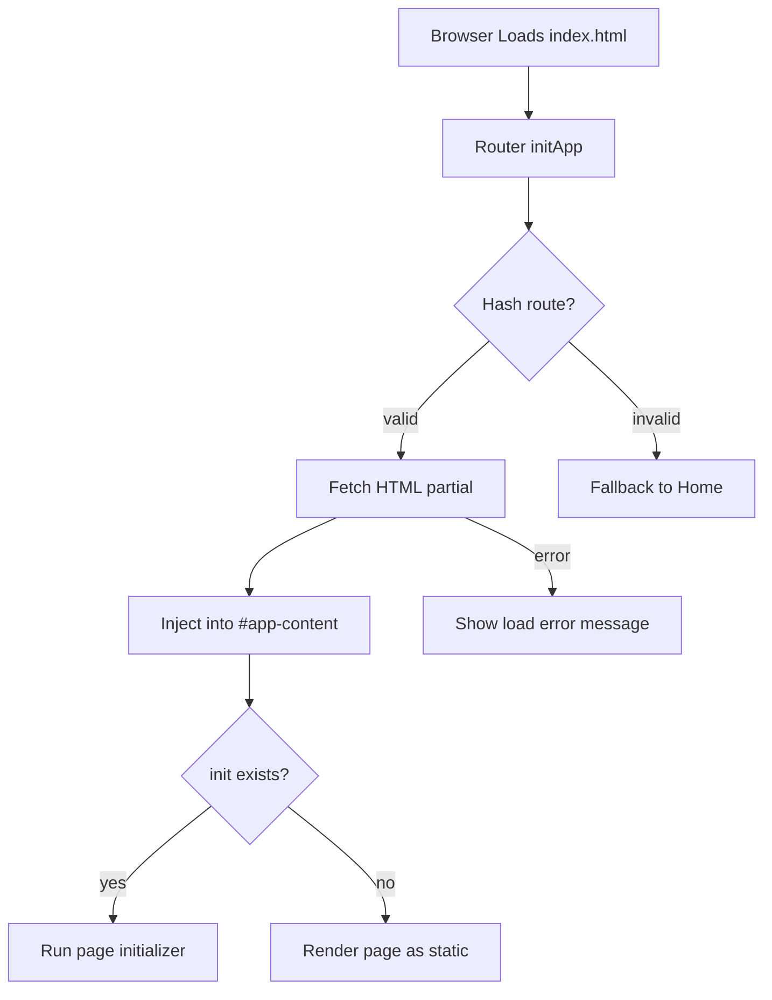
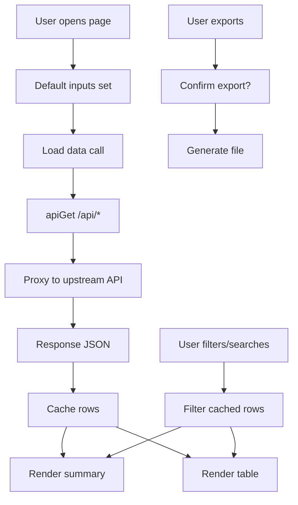

# Swagger Metrics — Flow Diagrams

## 1. Page Routing and Initialization


## 2. Standard Page Data Flow


## 3. Tree Endpoints Hash Logic
```mermaid
flowchart TD
  A[Incoming request to /api/* tree endpoint] --> B{accounthash provided?}
  B -->|yes| C[Use accounthash]
  B -->|no| D{username provided?}
  D -->|yes| E[MD5(username)]
  D -->|no| F[Use ROOT_HASH]
  C --> G[Call upstream API]
  E --> G
  F --> G
  G --> H[Return JSON response]
```
